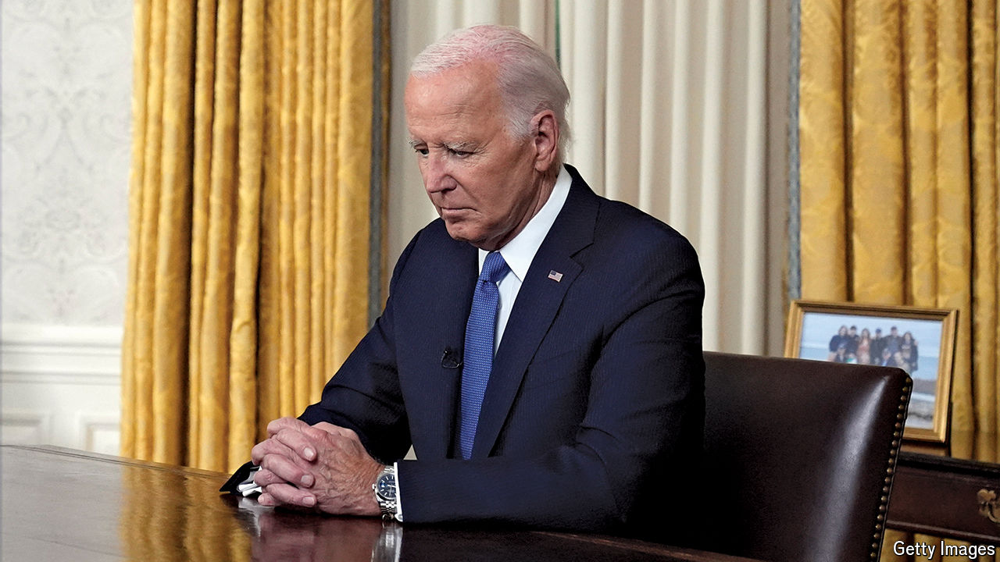

###### The world this week

# Politics 

#####  

 

> Jul 25th 2024 

 withdrew from the presidential race. His resignation came after several prominent figures called on him to step aside. He endorsed Vice-President Kamala Harris to succeed him. In an Oval Office address on Wednesday the president said there is “a time and a place” for “new” and “younger voices”.

