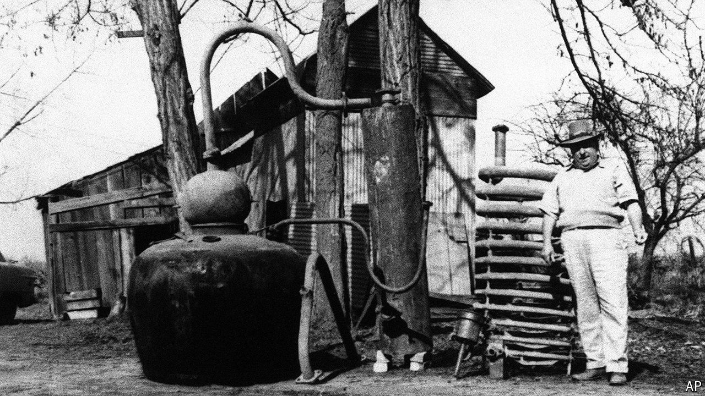

###### Native spirit

# A Texas judge gives a nod to America’s at-home distillers 

##### Life, liberty and the pursuit of liquor 

 

> Jul 25th 2024 

In Devils Lake, North Dakota, a man named Ray is making a batch of watermelon moonshine. A video posted to Facebook shows his ruby-red liquid bubbling. “Sounds like Rice Krispies,” he wrote. The copper still he makes it in is in his garage. Officially, he claims the set-up is just for distilling water and hand-sanitiser.

