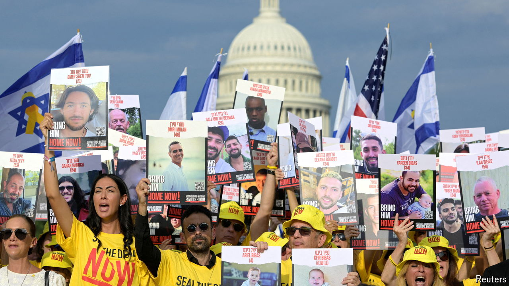

###### Kammander-in-chief?

# How to decode Kamala Harris’s foreign policy 

##### Expect tougher words on Israel, and continuity on Russia and China 

 

> Jul 24th 2024 

KAMALA HARRIS’S first show on the world stage as the Democrats’ presumptive new presidential nominee is a disappearing act: on July 24th she absented herself from an address by Binyamin “Bibi” Netanyahu, Israel’s prime minister, to a joint meeting of Congress. As vice-president, and president of the Senate, Ms Harris would normally have overseen the event alongside Mike Johnson, speaker of the House. Instead she attended a previously scheduled event in Indianapolis to talk to Zeta Phi Beta, a historically black sorority. Republicans, who have come to embrace Israel with ardour, denounced her no-show as “outrageous”. 

