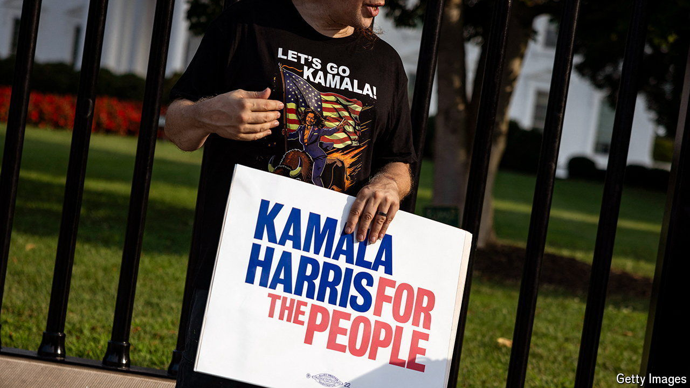

###### Patience, please

# Reliable numbers on Trump v Harris are scarce for now 

##### But the forecasting and tracking of America’s presidential race will resume shortly 

 

> Jul 25th 2024 

It was not just politicians and journalists who had to scramble to respond to President Joe Biden’s abrupt withdrawal from the election. Pollsters also rushed to get the first reactions from voters. A Reuters/Ipsos poll found Kamala Harris leading Donald Trump by 44% to 42%.  polling partner, YouGov, found that Ms Harris still trailed by 41% to 44%, roughly in line with Mr Biden’s polling before he dropped out on July 21st.

