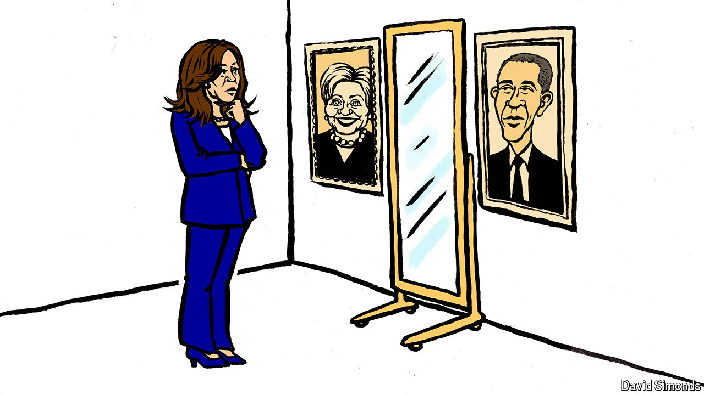

###### Lexington

# What identity politics will Kamala Harris practise? 

##### The lessons of Barack Obama, Donald Trump, J.D. Vance and Hillary Clinton 

 

> Jul 25th 2024 

When it comes to taking advantage of identity in politics, the two most effective American candidates this century have been Barack Obama and Donald Trump. Mr Obama had written the best campaign book ever, “Dreams from My Father”, sorting out his own identity. But as a candidate in 2008 he recognised that his identity would speak most eloquently for itself, as would the historic nature of his campaign, implicitly but incandescently illuminating his message of change. By not stressing the obstacles he had to overcome to travel so far as a black man, he made the prospect of his election a compliment not to himself but to America, for overcoming the burden of history. It was maybe the most elegant judo move in American politics, one that turned the weight of racism against itself. “Yes we can,” voters found themselves saying along with him. Mr Obama carried 52.9% of the popular vote, still the largest margin of any president since 1988.

