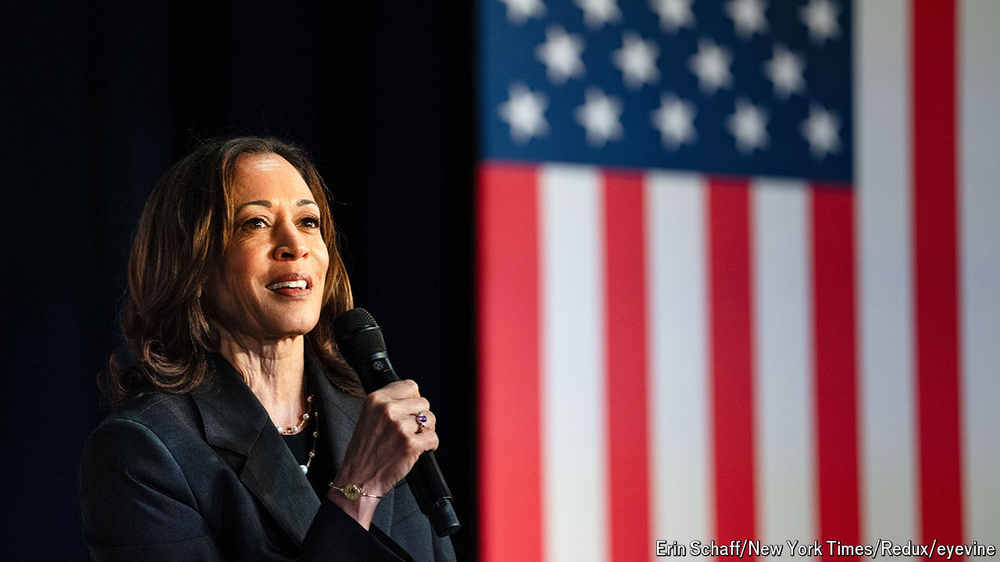

###### The switch in time

# Which Kamala Harris is now at the top of the Democratic ticket? 

##### The race to define the new presumptive nominee 

 

> Jul 25th 2024 

IT IS BAD form to be dour, doubting or dissenting at a coronation. And Democrats are a well-behaved lot. On July 21st President Joe Biden abandoned his bid for re-election, less than a month before he was to be formally nominated at the party’s convention in Chicago. One day later, his anointed successor, Vice-President Kamala Harris, had secured the spot before any simulacrum of a contest could even begin. Mr Biden transferred his whole campaign infrastructure immediately; his campaign renamed itself “Harris for President” within hours. Her mooted opponents went prostrate: every sitting Democratic governor had endorsed her within a day.

