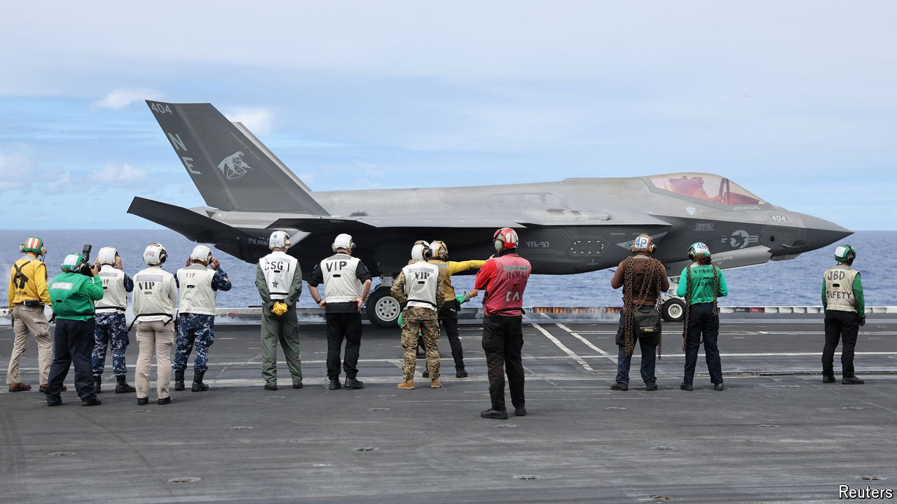

###### Double act

# America remains Asia’s military-exercise partner of choice 

##### A new report shows just how far China is falling behind 

 

> Aug 1st 2024 

As a demonstration of brute sea power, few events can match the biennial Rim of the Pacific exercise (RIMPAC) hosted by America in Hawaii. The world’s largest naval drill, which was due to finish on August 2nd, after this article was published, has brought together 25,000 sailors, airmen and soldiers from 29 countries. Over the past month like-minded navies have honed their skills on tasks ranging from disaster relief to anti-submarine warfare. It has included a “sinking exercise”: the opportunity to torpedo a rusty, 36,000-tonne American amphibious-assault ship. 

