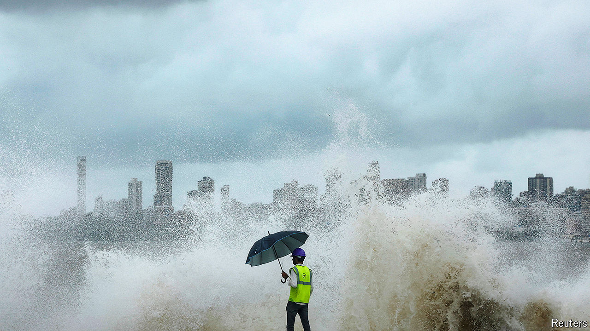

###### Urbanisation

# Indian cities are utterly unprepared for what is about to hit them 

##### The urban population is set to double by 2050 

 

> Aug 1st 2024 

THE BRITISH, under whose colonial rule Bombay grew from a collection of mosquito-infested islands into a metropolis, called their creation “Urbs Prima in Indis”—the first city in India. So it remains. Home to corporate headquarters, the country’s biggest port, and the film and television industries, Mumbai—as it has been called since 1995—is the richest, densest and most liberal city in the country. It is urban India at its most intense. 

