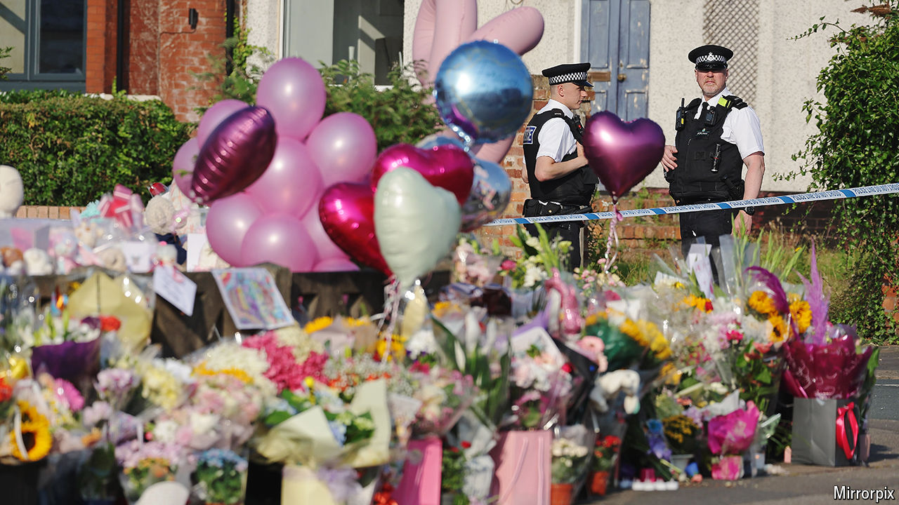

###### A tragedy, then a riot

# A riot in Southport shows how the British far right is changing 

##### It has become easier to spread lies and stir up trouble online 

 

> Jul 31st 2024 

IT WAS AN ugly moment in a traumatic week. Sir Keir Starmer had come to visit the site of a horrific knife attack that had taken place on July 29th in Southport in which three children had been killed and ten others injured. By the time the prime minister arrived in the seaside town in north-west England the next day, conspiracy theories had been swirling online for hours. An angry mob heckled him as he lay flowers. “Get the truth out,” one yelled. 

