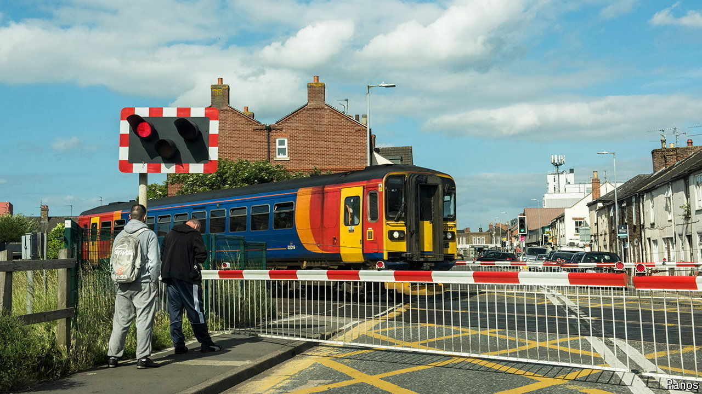

###### A fatter controller

# Britain’s railways go from one extreme to another 

##### Departing: privatisation. Destination: centralisation 

 

> Aug 1st 2024 

When britain’s railways were nationalised for the first time, in 1948, politicians steamed. Conservative peers called it “a most ghastly mistake” and “by far the biggest measure of Socialism which had ever been proposed in the world outside Russia”. By contrast, the new government’s renationalisation programme is chugging along quietly. A bill to bring passenger-train operations into public ownership passed its second reading in the House of Commons on July 29th, following a thinly attended debate. Polls show that most people, including most Conservative voters, approve. 

