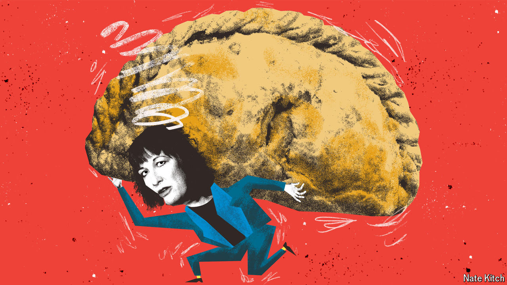

###### Bagehot

# British voters care less about tax rises than politicians think 

##### So if you’re going to increase a tax, make it a big one 

 

> Jul 31st 2024 

The Cornish pasty looms large in David Cameron’s memoirs. In 2012 the then Conservative government decided to levy vat on hot takeaway food such as the beefy snack. It was a measly scheme that would have raised an annual £110m ($140m; 0.005% of gdp).  “Pasties,” Lord Cameron despaired. “I hadn’t even thought about pasties.” For page after page, he gaily recalls the scandal which saw headlines of “Let Them Eat Cold Pasty” and a Marie Antoinette lookalike hounding George Osborne, his chancellor of the exchequer. 

