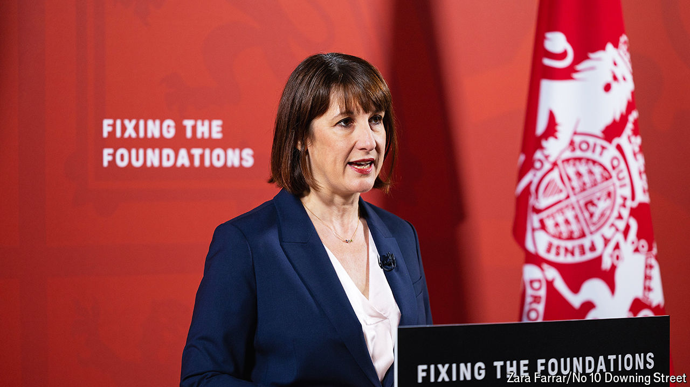

###### Fiscal feuding

# How deep is Britain’s fiscal “black hole”? 

##### Rachel Reeves sets out her first big decisions as chancellor 

 

> Jul 29th 2024 

THE FIRST months of a new British government are precious. Problems can be blamed on ministers’ predecessors, who will struggle for a hearing. Capitalising on that honeymoon can neutralise the political costs of tough choices: George Osborne, a former Conservative chancellor, moved quickly in 2010 to pin swingeing spending cuts on Labour’s profligacy. Britain’s new  is following the same playbook. On July 29th Rachel Reeves presented the results of an audit into the public finances, which she had commissioned straight after the election.

