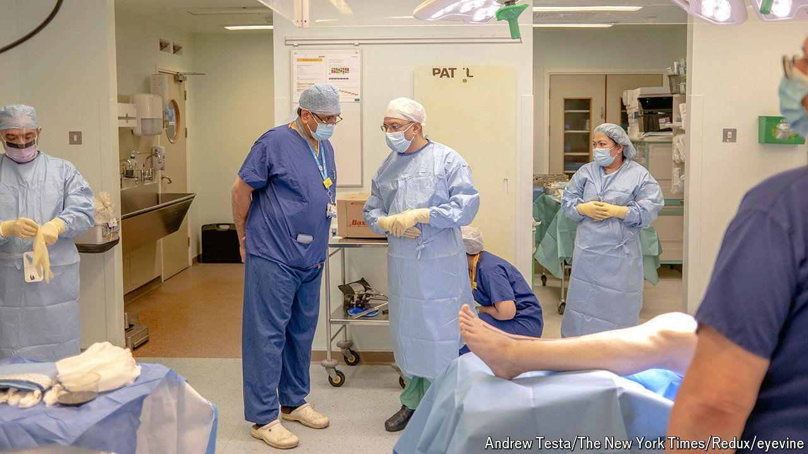

###### Short-termitis

# The disease that most afflicts England’s National Health Service 

##### Stopping raids on capital budgets would be a start 

 

> Aug 1st 2024 

On July 29th the new Labour government announced a pay deal with the British Medical Association that would give junior doctors in England a pay rise of 22% over two years. If accepted it will bring an end to the longest period of industrial unrest in the history of the National Health Service (NHS), which has led to the cancellation of almost 1.5m appointments. 

