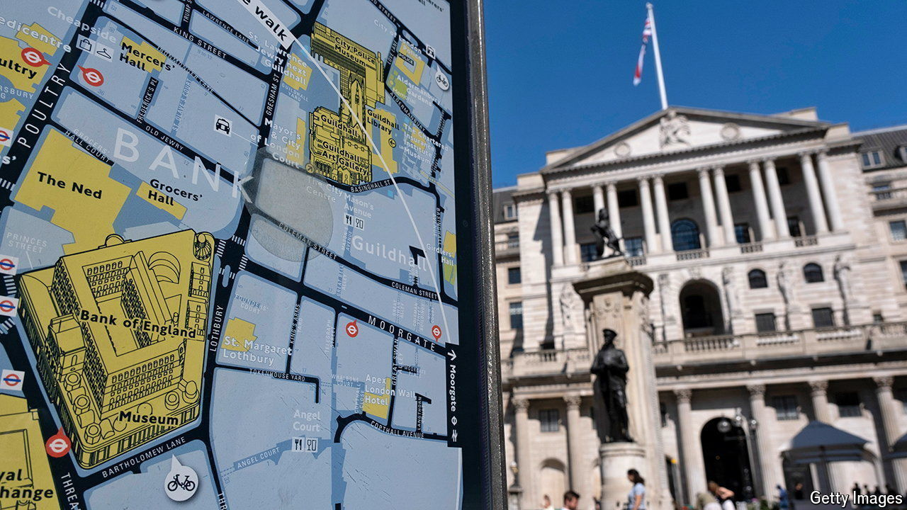

###### Cutting loose

# Was the Bank of England right to start lowering interest rates? 

##### Andrew Bailey takes a calculated risk 

 

> Aug 1st 2024 

It was a close call. On August 1st the Bank of England announced that it was cutting interest rates by 0.25 percentage points. The votes of its Monetary Policy Committee (MPC) were split five to four. Ahead of the announcement, markets had also been divided, pricing in roughly a 60% chance of a cut. The bank says it intends to reduce rates only gradually from here. Markets reckon it will do so once more before the end of the year (see chart).

