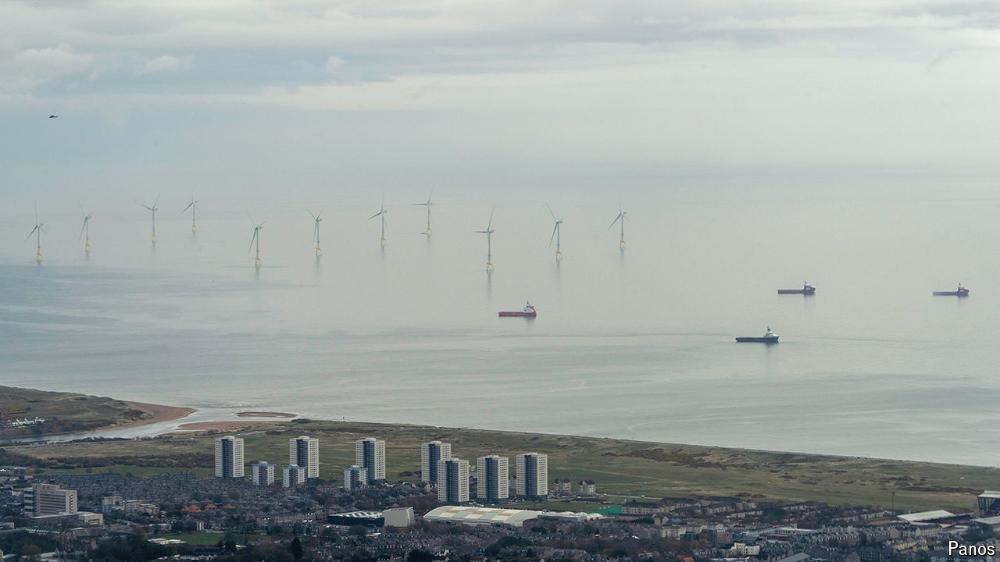

###### Transition of power

# What will Great British Energy do? 

##### The new body’s first job is to unblock private investment 

 

> Aug 1st 2024 

When Sir Keir Starmer proposed a state-owned company called Great British Energy in September 2022, he was aping the man dragged out of 10 Downing St two months earlier. Sir Keir had studied Boris Johnson’s bracing pledge to “take back control” in the 2016 Brexit referendum. Adapting this mantra, the then opposition leader griped that the only governments with a stake in Britain’s energy system were foreign ones, from Sweden, France and China. GB Energy would secure “British power for British people”. It would also allow him to ditch a more radical plan for wholesale renationalisation.

