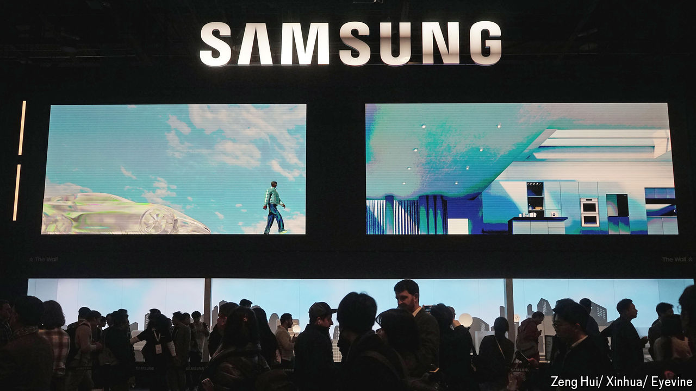

###### Semi-successful

# Can Samsung get its mojo back? 

##### Its profits are surging, but its technology is lagging behind 

 

> Aug 1st 2024 

Samsung Electronics, South Korea’s most valuable company, is the archetype of vertical integration. The smartphones and other consumer electronics it is best known for accounted for about half of its revenue and a quarter of its operating profit in the period from April to June. The rest came from the components that go into such devices—including the semiconductors that run them.

