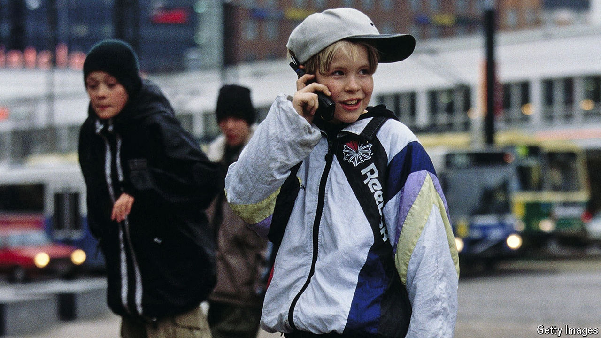

###### Screened out

# Dumb phones are making a comeback 

##### They even have Snake 

 

> Aug 1st 2024 

It is hard to imagine life without a smartphone these days. Leave yours at home and you may find yourself lost, moneyless and severed from social contact. Nine in ten American adults own one, according to Pew Research Centre. They spend 3 hours and 45 minutes on them a day, on average, reckons GWI, a firm of analysts. New versions souped up with artificial intelligence may be even harder to put down.

