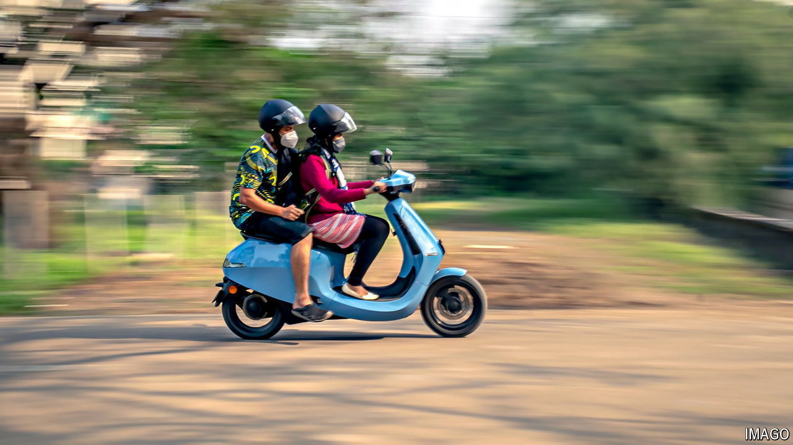

###### Two wheels good

# India’s electric-scooter champion goes public 

##### It promises to be a wild ride for investors 

 

> Aug 1st 2024 

Two-wheeled vehicles are an integral part of life in India. They whizz over the country’s broken, clogged roads, carrying families and loads that would fill a small lorry. India manufactures about 20m of them each year, making it one of the world’s leading producers. It is fitting, then, that the country’s largest initial public offering (IPO) so far this year is for an electric-scooter company. On August 2nd Ola Electric plans to sell around $730m of shares at a price that will value the firm at roughly $4bn.

