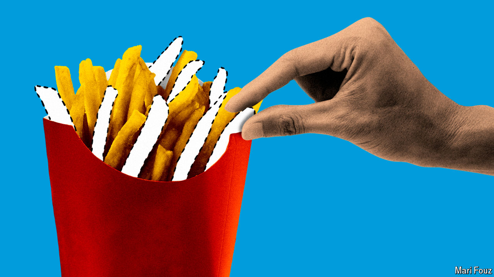

###### Schumpeter

# What Chipotle and McDonald’s say about the consumer slowdown 

##### Americans still want more than just the lowest price 

 

> Jul 31st 2024 

Near Schumpeter’s home in Los Angeles are two fast-food restaurants almost kitty-corner to each other, as Americans quaintly put it. In different ways, both help explain one of the biggest puzzles in today’s business environment: the state of the American consumer. One is Chipotle Mexican Grill, a canteen-like restaurant famous for its burritos and bowls of chicken, the cheapest of which comes with rice, beans, salsa and various other toppings, and which costs $10.60. The other is McDonald’s, home of the hamburger. Its cheapest meal deal is $5. It comes with a burger, nuggets, fries and such generous quantities of salt it is a blessing that there is a fizzy drink to wash it down with. 

