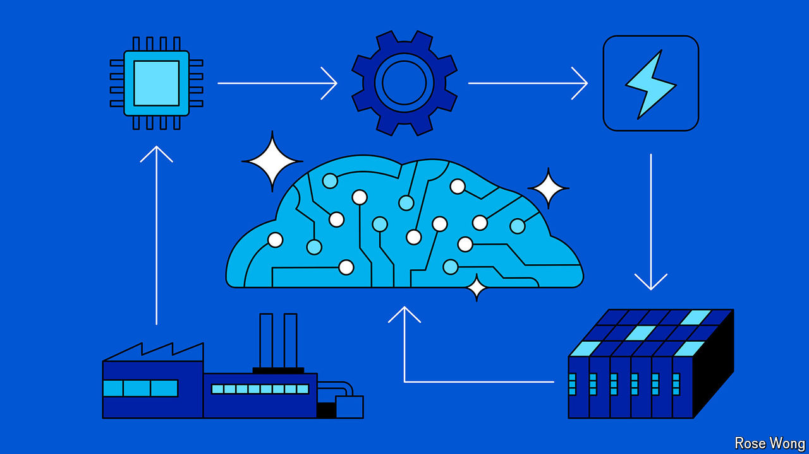

###### Feeding the machine

# What could kill the $1trn artificial-intelligence boom? 

##### A fast-growing supply chain is in danger of over-extending 

 

> Jul 28th 2024 

“The risk of under-investing is dramatically greater than the risk of over-investing,” said Sundar Pichai, the boss of Alphabet, which owns Google, on a recent earnings call. He, like lots of executives nowadays, was talking about artificial intelligence (AI). More specifically, he was talking about building AI data centres to serve the customers of the tech giant’s cloud-computing arm. The sums involved are eye-popping. Alphabet’s capital spending is expected to grow by about half this year, to $48bn. Much of that will be spent on AI-related gear. 

