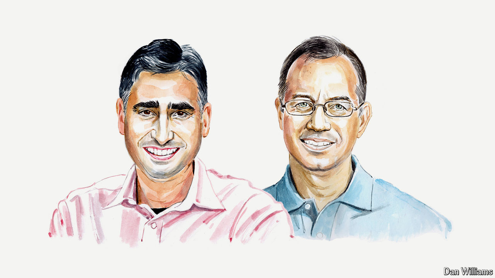

###### Artificial intelligence

# Keep the code behind AI open, say two entrepreneurs 

##### Martin Casado and Ion Stoica argue that open-source models will power innovation without compromising security 

 

> Jul 29th 2024 

NO ONE DOUBTS that artificial intelligence (AI) will change the world. But a doctrinal dispute continues to rage over the design of AI models, namely whether the software should be “closed-source” or “open-source”—in other words, whether code is proprietary, or public and open to modification by anyone. 

