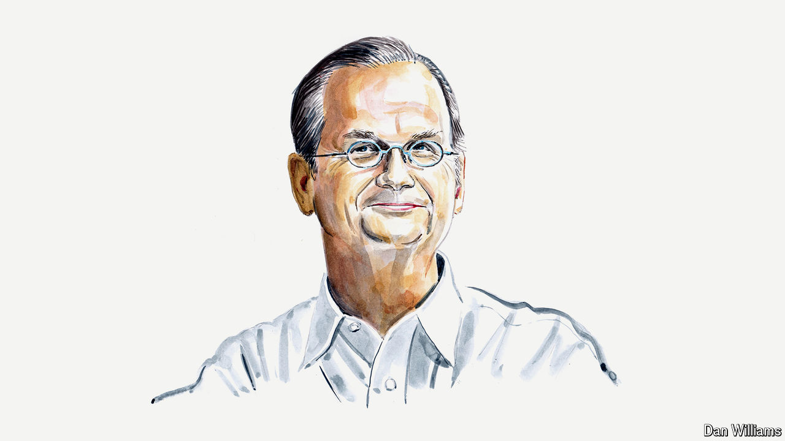

###### Artificial intelligence

# Not all AI models should be freely available, argues a legal scholar 

##### The more capable they are, the greater the risk of catastrophe, reckons Lawrence Lessig 

 

> Jul 29th 2024 

FREE AND open-source software has driven technological innovation and the spread of technical skills. The freedom to share and build upon software developed by others has given countless young coders the chance to learn, and is at the core of the businesses that power the digital economy. 

