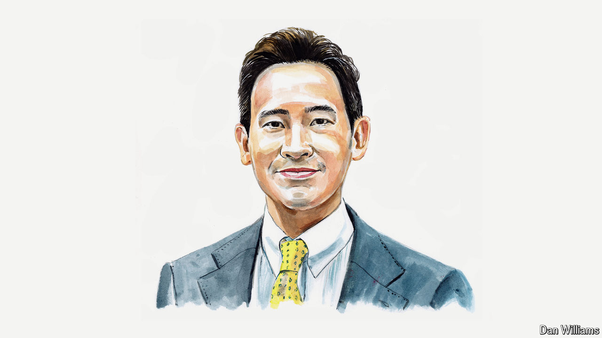

###### Thai politics

# Thailand’s thwarted election winner on the move to ban his party 

##### Weaponising the courts to muzzle dissent will fail in the long run, says Pita Limjaroenrat 

 

> Aug 1st 2024 

WHEN I LED the Move Forward Party to victory in the general elections of May 2023, the country was euphoric. Many Thais, along with international observers, believed the kingdom was on the cusp of a progressive renaissance, with the electorate’s will finally triumphant. A post-election pact among opposition parties seemed to pave the way for me to become the next prime minister through a parliamentary vote. 

