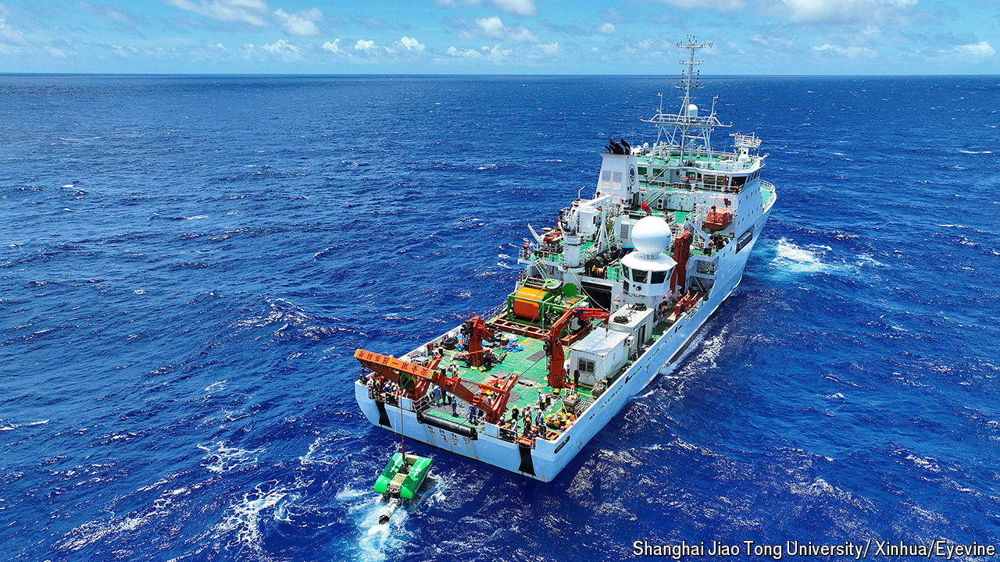

###### Sunken treasures

# China is itching to mine the ocean floor 

##### It wants to dominate critical-mineral supply chains 

 

> Jul 28th 2024 

SCATTERED ACROSS the ocean floor are trillions of lumps of nickel, copper, cobalt and manganese. Companies have long wanted to mine them: these “critical minerals” are needed in vast quantities to electrify the global economy and cut dependence on fossil fuels. But the International Seabed Authority (ISA), a UN body, is still figuring out how mining should be regulated. Some environmental groups want an outright ban. Supporters and critics of  are hashing out these issues at an ISA meeting in Jamaica between July 29th and August 2nd. Of the 160-odd countries participating, few have more interest in the outcome than China.

