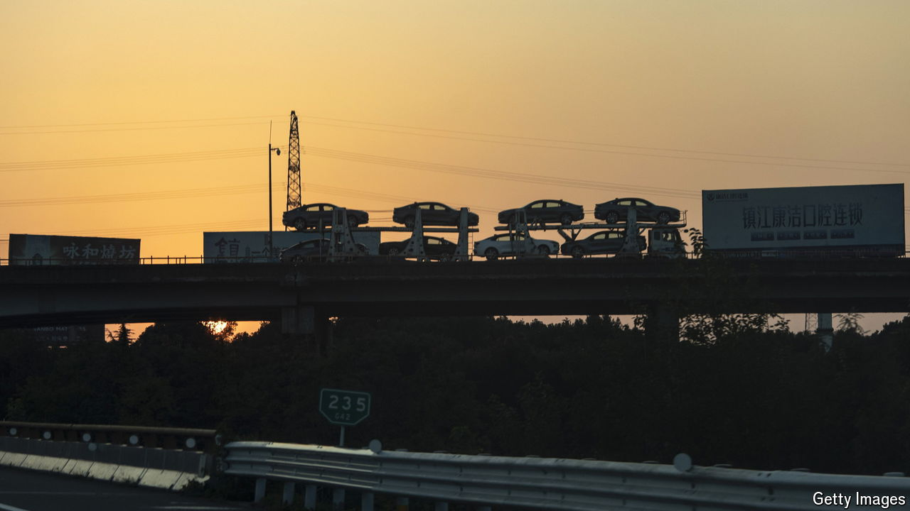

###### Slowing down, trading up

# To revive the economy, China wants consumers to buy better stuff 

##### It is offering them money to do so 

 

> Aug 1st 2024 

EVERYWHERE YOU look, the world’s politicians face tough economic choices. In many countries, they must raise taxes, cut spending or put up with high interest rates to keep inflation in check and make room for investment in the future. China is different. In the world’s second-biggest economy, inflation is too low, investment is excessive and interest rates are falling. The government’s most urgent economic task is to encourage citizens to loosen their belts, not tighten them.

