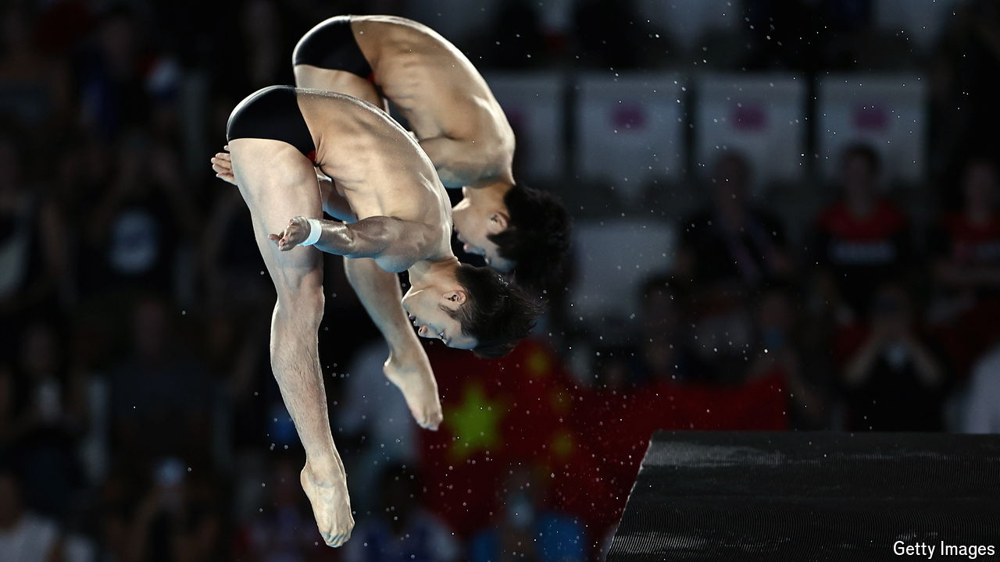

###### Flipping talented

# Which Olympic sports is China good at? 

##### The country’s athletes seem to prefer competing indoors and as individuals 

 

> Aug 1st 2024 

On July 29th Lian Junjie and Yang Hao (pictured) leapt off a ten-metre-high platform, twisting and flipping in near-perfect synchronisation. Before the Olympic judges even posted their marks, Chinese fans celebrated. Then it became official: the pair had won gold, beating divers from Britain. China has won 50 gold medals in the sport of diving over the years, more than any other country.

