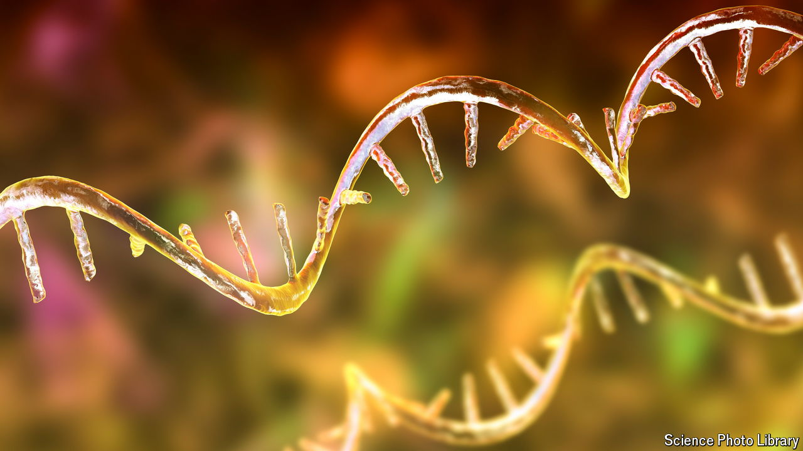

###### Biology

# A primer on RNA, perhaps the most consequential molecule of all 

##### “The Catalyst” looks at RNA’s role in life’s origins as well as its medical uses 

 

> Jul 31st 2024 

Thomas Cech.

