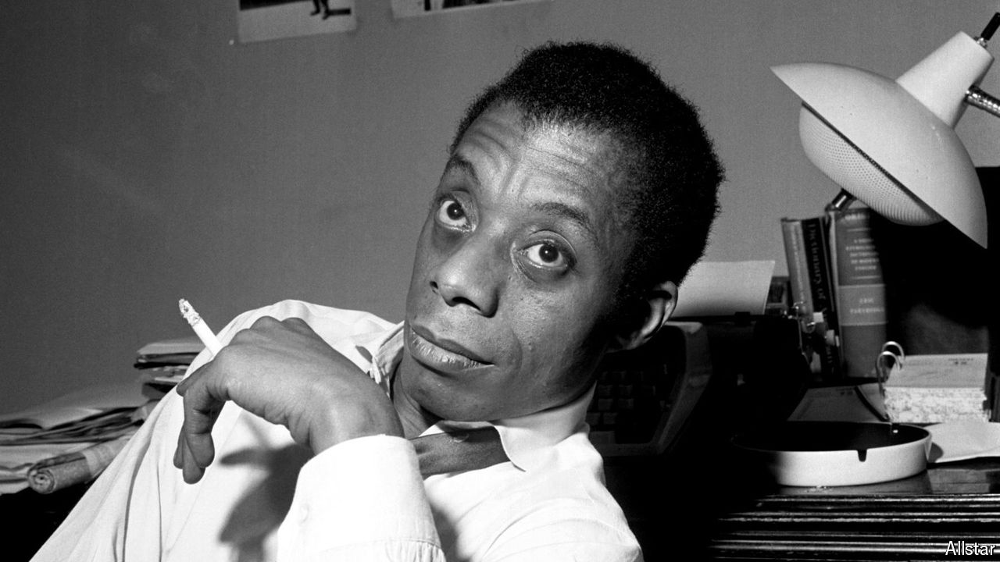

###### A mountainous legacy

# Few writers have seen America more clearly than James Baldwin 

##### A century after his birth, Baldwin remains one of the country’s most important authors 

 

> Aug 1st 2024 

IN THE months after a young black man in Ferguson, Missouri, was shot by a white policeman in 2014—galvanising the Black Lives Matter movement—no prominent African-American writer was invoked more often on social media than James Baldwin. That was no surprise: Baldwin was an eloquent civil-rights activist, whom the FBI watched anxiously and who counted  among his friends. Yet as Robert Reid-Pharr, a professor at New York University, jokes: “James Baldwin never wrote a sentence of 140 characters, ever.” 

