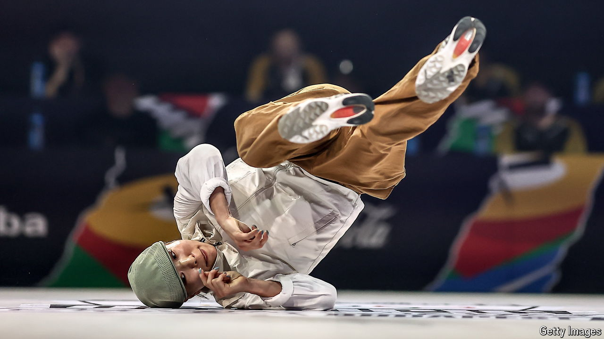

###### Finding the beat

# The Paris Olympics are breaking’s one shot to become a global sport 

##### But its inclusion was not without controversy 

 

> Jul 29th 2024 

“WE SEE BREAKdancing as a future Olympic sport and ourselves as pioneers in making this dream a reality.” So proclaimed the New York City Breakers, a dance group, in 1984. Forty years later, on August 9th and 10th, 32 breakers—known also as B-boys and B-girls—will grace the stage in the Place de la Concorde in . 

