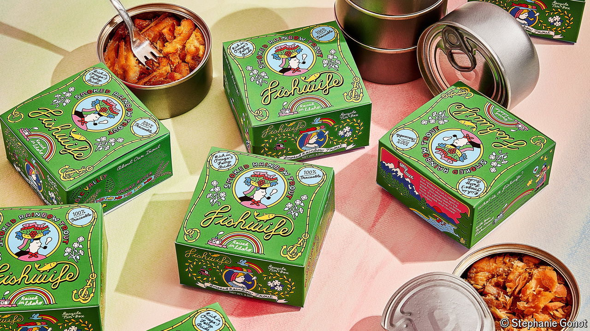

###### World in a dish

# Tinned fish is swimming against the tide 

##### Once a staple of wartime diets, it is now a social-media phenomenon 

 

> Jul 30th 2024 

Mei Liao pulls back the can’s lid to reveal sardines swimming in a garlic and herb butter. In other videos she stuffs russet-coloured smoked mackerel into a sandwich or arranges sprats with capers and cucumber. Ms Liao says tinned fish is often considered “akin to cat food or bunker food”. But, posting as @daywithmei, she has turned it into a viral treat: her videos have millions of views on TikTok. 

