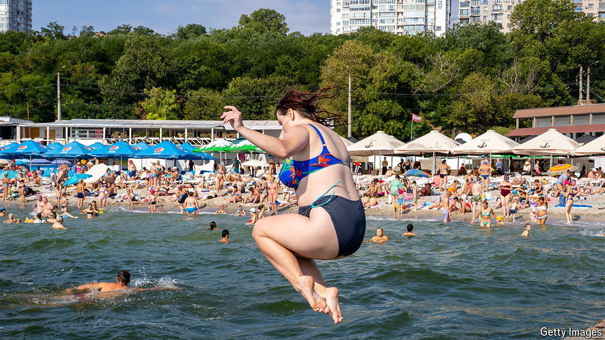

###### The water’s mostly demined

# Amid the bombs, Ukrainians rediscover the beach 

##### Odessa gives itself permission to tan again 

 

> Jul 30th 2024 

THREATS OF BALLISTIC missiles, drones and sea mines might ordinarily be enough to put holidaymakers off their buckets and spades. But nothing is so simple in Odessa, Ukraine’s good-time resort on the Black Sea. Two and a half years into war, its beaches are alive again with speedos, silicone and grandmothers selling shrimps and corn on the cob. Demand is so great that trains and hotels are sold out weeks in advance. Prices for the most expensive rooms at the prestigious Lanzheron beach have shot up to $1,000 a day. 

