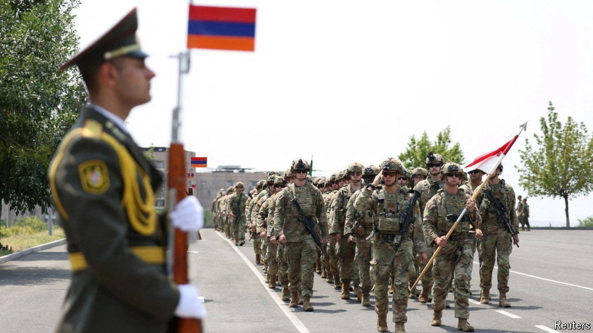

###### Westward ho!

# Humiliated by Azerbaijan, Armenia tacks towards the West 

##### Courting the EU and America without alienating Russia is a difficult trick 

 

> Aug 1st 2024 

The European Union boasts of being a regulatory superpower, not a military one. But in its relationship with Armenia it is starting to deploy both sorts of muscle. On July 22nd the EU announced that one of its military-assistance programmes will send aid to Armenia for the first time. The same day it opened visa-liberalisation talks. Meanwhile, American troops were conducting a small exercise with Armenian forces. It was all part of the pivot to the West begun last year by Nikol Pashinyan, the prime minister. 

