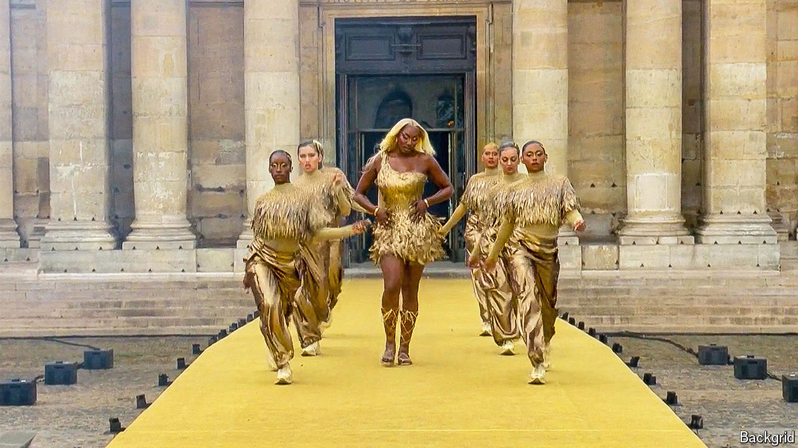

###### Allez les bleus

# The Olympics are teaching the French to cheer again 

##### France’s politics is a mess, but the games are glorious 

 

> Aug 1st 2024 

The Olympic games are doing something very odd to France. Traditionally, the country has embraced jaded critique as a national character trait. Now the hosts of the games, who on July 31st ranked second in the medal table, seem to be shrugging off their studied glumness and reaching for superlatives as if for a bottle of chilled summer rosé. Léon Marchand, the swimming champion, has become “”. After the spectacular opening ceremony along the Seine on July 26th , the bible of the understated Paris intellectual, went full tabloid: “MAGIC!” 

