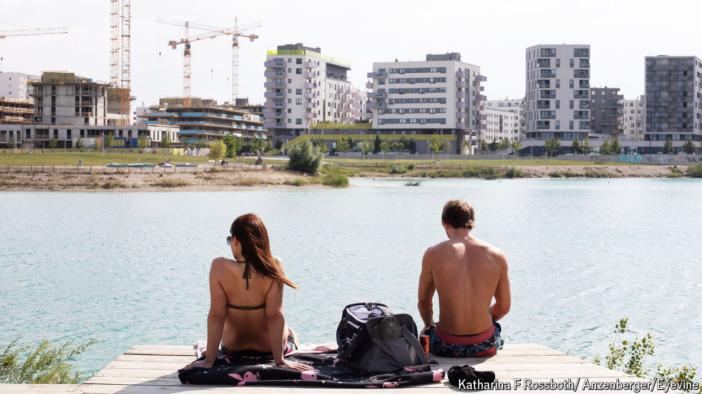

###### Paradise cost

# Vienna’s social housing, lauded by progressives, pushes out the poor 

##### The city’s most hard-up rely on the private sector 

 

> Aug 1st 2024 

With the mercury hitting 35°C this summer, many Viennese have headed for rooftop pools. At Aspern Seestadt, one of Europe’s largest housing projects, they can plunge into an artificial lake or take the kayak out for a paddle. Such are the joys of the projects, Viennese-style. Aquatics for the many, not the few. 

