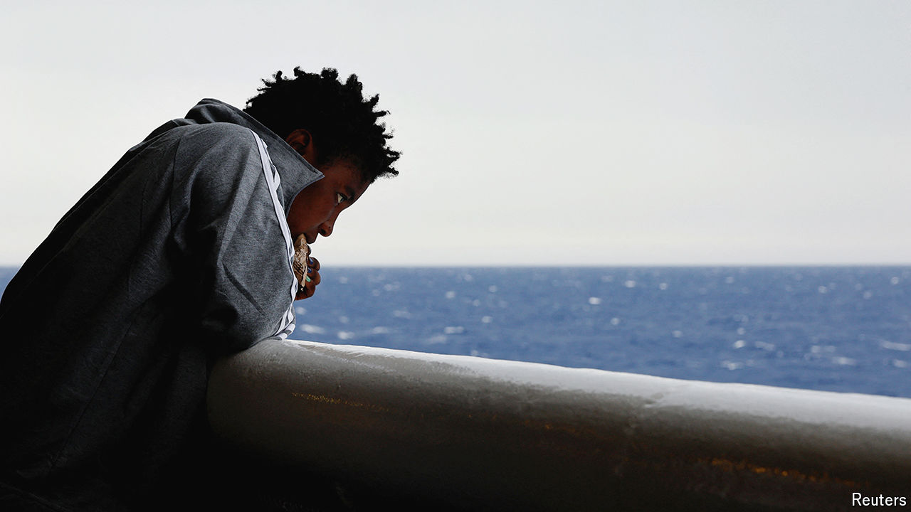

###### Devil and the deep blue sea

# Will a new “pact” of ten laws help Europe ease its migrant woes? 

##### It will require an extraordinary number of institutions to work together 

 

> Jul 30th 2024 

THEY MOVE stiffly on weak legs as they leave the bus and enter the fenced-off temporary centre on El Hierro, one of the Canary Islands. Spanish police register each one, reading the number off a wristband they were given at the port, calling out: “U8, adult female! U3, minor male!” Then come the men, who make up the vast majority: of the 145 arrivals on that day’s boat, eight are women and three children. Nearly all are sub-Saharan Africans.

