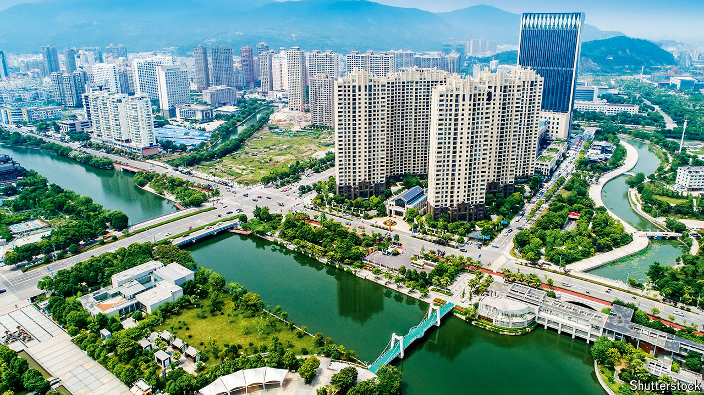

###### Keeping the flame alive

# China’s last boomtowns show rapid growth is still possible 

##### All it takes is for the state to work with the market 

 

> Jul 30th 2024 

China’s economic miracle emerged from dozens of industrial entrepots. Dongguan, famous for producing furniture and toys, as well as its many brothels, witnessed GDP growth of 21% in 2004. Hohhot, a town on the edge of the Mongolian steppe, posted growth of 18% in 2006 as it scarred its mineral-rich terrain with mines. Shanghai, the country’s commercial hub, achieved 15% growth the next year as it churned out everything from machinery and textiles to cargo ships and steel, minting millionaires in the process.

