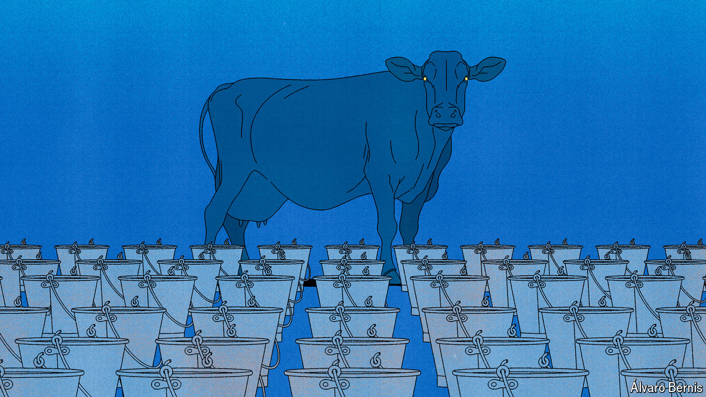

###### Free exchange

# EU handouts have long been wasteful. Now they must be fixed 

##### New research highlights their failures 

 

> Aug 1st 2024 

Budget talks in the European Union are a game of 27-dimensional chess. Members play simultaneously against one another, negotiating over many spending items at any one time. Countries are already preparing for the contest that starts next year, which is likely to be particularly dramatic. The world around the EU has shifted, owing to the war in Ukraine, the continent’s increasingly difficult relationship with China and the growing urgency of climate change. That necessitates what Mario Draghi, a former president of the European Central Bank and prime minister of Italy, has called “radical change”. Yet the bloc’s biggest contributors, including Germany and the Netherlands, will be reluctant to stump up more cash. New outgoings for climate change and defence will have to be funded by cuts elsewhere. 

