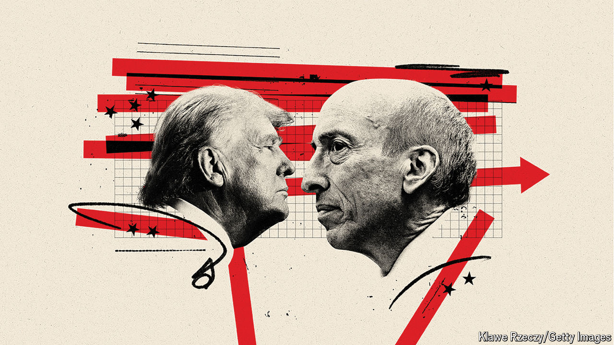

###### Seeking security

# Gary Gensler is the most controversial man in American finance 

##### Donald Trump is just the latest to take a swing. In an interview with The Economist, the SEC chair defends his record 

 

> Aug 1st 2024 

How many Securities and Exchange Commission chairs can you name? Even in Washington it is hard to imagine a passer-by being able to come up with more than one. Perhaps the best known is Joe Kennedy, the sec’s first chairman, who took office during the Depression when Americans had lost faith in markets and were clamouring for protection against conmen and fraudsters. And he is most famous for fathering a president.

