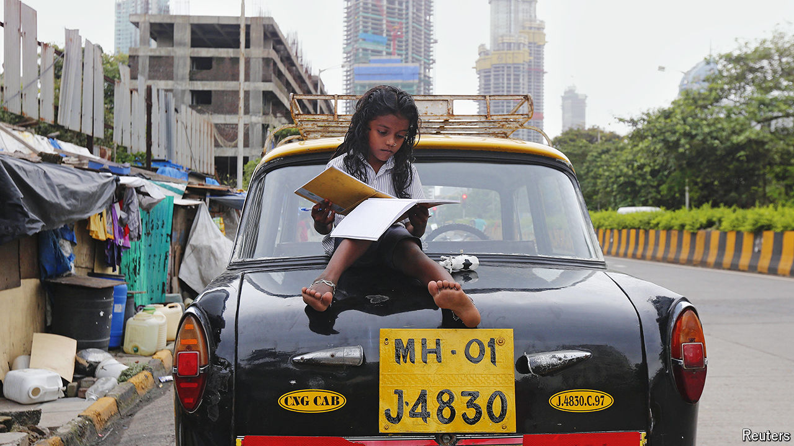

###### Modi’s missteps

# India’s economic policy will not make it rich 

##### A new World Bank report takes aim at emerging-market growth plans 

 

> Aug 1st 2024 

The developing world has fallen back in love with economic planning. As protectionism sweeps the West, poor countries are no longer afraid of industrial policy—or bold ambition. India’s government declares that manufacturing will propel the country to high-income status by 2047. Indonesia wants to get there by 2050, with growth driven by green commodities. Vietnam is aiming for annual gdp growth of 7% until 2030. By the same time, South Africa wants to have more than doubled its income per person from 2021. Surely economies everywhere are about to accelerate.

