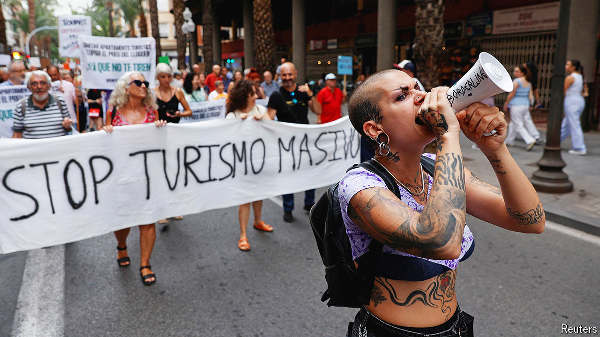

###### Hotting up

# What the war on tourism gets wrong 

##### Visitors are a boon, if managed wisely 

 

> Jul 29th 2024 

Cooling off is easy in Barcelona. Swim in the sea, sip sangria—or just hang about looking like a holidaymaker. Recently residents have taken part in anti-tourist protests, some firing at guests with water pistols. Other rallies calling for an end to mass tourism have taken place across the Balearic and Canary Islands. And it is not just Spaniards. Locals in Athens have held funerals for their dead neighbourhoods. Authorities in Japan have put up a fence to spoil a popular view of Mount Fuji and prevent tourists gathering. Soon there will be a 5pm curfew for visitors to a historic neighbourhood in Seoul.

