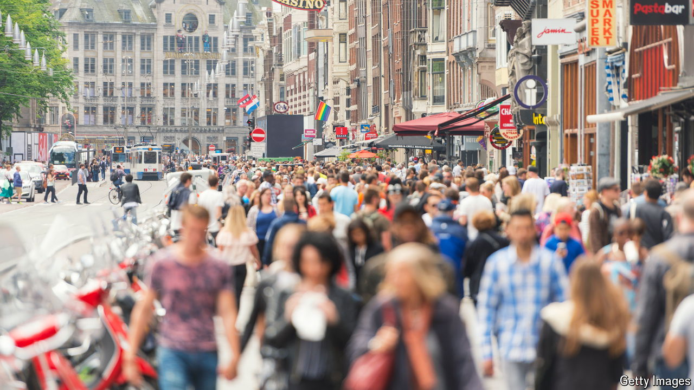

###### Beat the crowds

# Which cities have the worst overtourism problem? 

##### We rank popular destinations on two measures 

 

> Aug 1st 2024 

Cities everywhere are busy implementing measures to deter excess tourism. But most people agree holidaymakers offer an economic bounty. So what would the ideal tourist market look like? Residents would probably prefer a small number of high-spending visitors, to minimise disturbance and maximise revenues. Figures compiled by rank 20 popular destinations on their appeal to international travellers, and provide a sense of which cities are nearest to—and furthest from—this ideal. 

