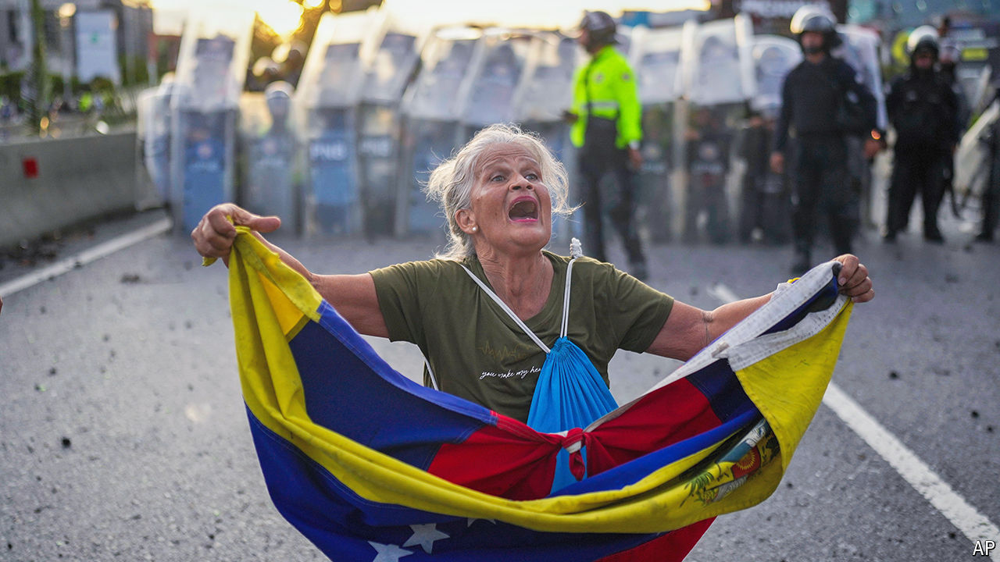

###### Daylight robbery

# Can Nicolás Maduro be stopped from stealing Venezuela’s election? 

##### Peaceful protests and judicious diplomacy offer some hope 

 

> Jul 31st 2024 

THERE COMES a moment in a country’s descent into dictatorship when a heavily armed regime tries to force millions of people to accept that black is white, bad is good and losers are winners. By so blatantly  on July 28th, President Nicolás Maduro has ensured that for Venezuela that moment is  .

