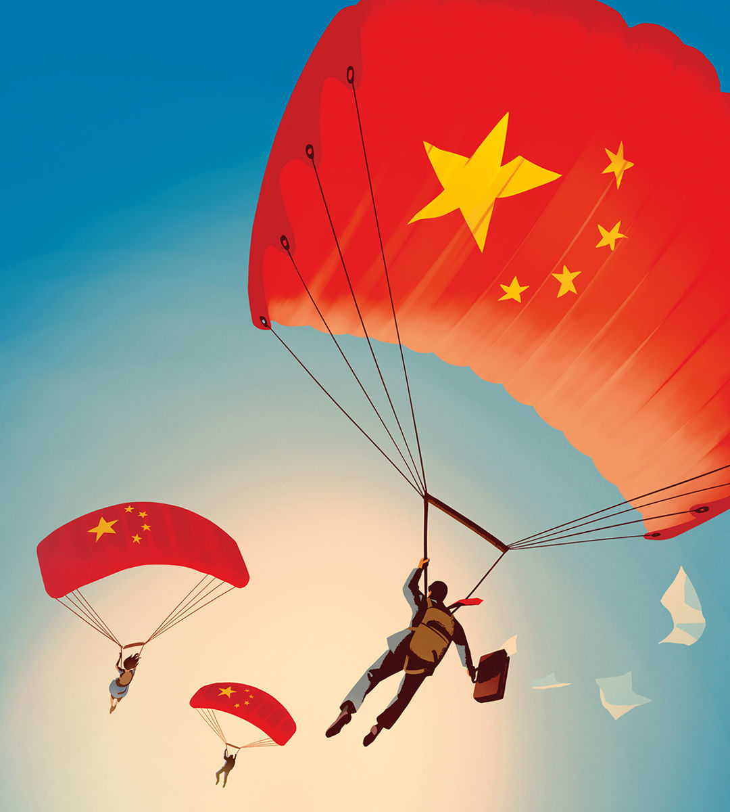

###### Going global

# Chinese companies are winning the global south 

##### Their expansion abroad holds important lessons for Western incumbents 

 

> Aug 1st 2024 

Since the end of the cold war the rich world’s corporate giants have been the dominant force in global commerce. Today consumers and workers in almost every country are touched in some way by the world-spanning operations of multinational firms from America, Europe and, to a lesser extent, Japan. These leviathans are now under threat, as Chinese firms in industries from cars to clothing expand abroad with startling speed. A new commercial contest has begun. Its battleground is neither  nor the rich world, but the fast-growing economies of the .

