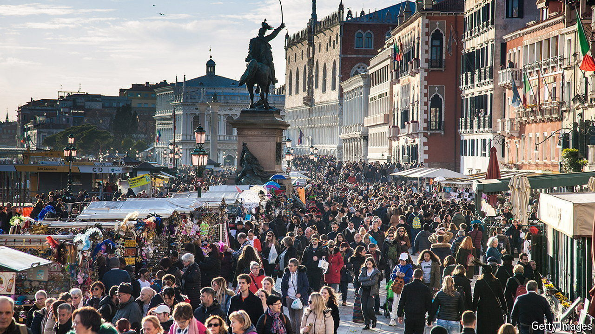

###### The travel boom

# How to make tourism work for locals and visitors alike 

##### Holidays don’t have to be hell 

 

> Aug 1st 2024 

The dollar is hovering near a two-decade high. That has unleashed a multitude of American tourists keen to exercise their newfound , much to the dismay of snobbish Europeans and anyone who has a fondness for empty, unspoilt beaches. And it has done so at a time when tourism is back in fashion. Trips were up by 19% in the first quarter of this year, compared with a year ago. They are forecast to exceed pre-covid levels across the whole of the year.

