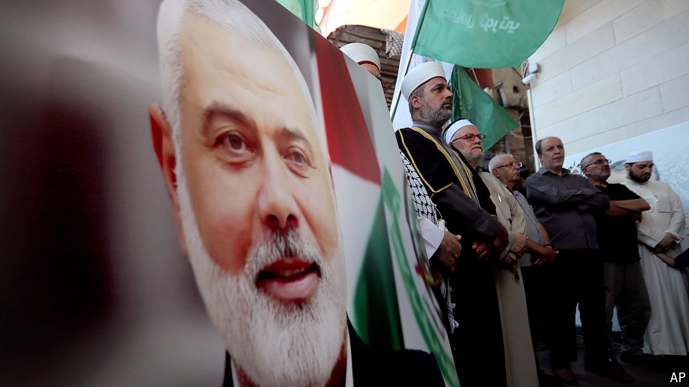

###### Ever closer

# The Middle East must step back from the brink 

##### That still means starting with a ceasefire in Gaza 

 

> Jul 31st 2024 

A WEEK can be a long time in war. Until July 27th there was growing optimism that Israel and Hamas were close to a ceasefire that would halt their ten-month conflict. Diplomats and spies from four countries planned to hash out the details at a meeting in Rome. Antony Blinken, America’s secretary of state, said the talks were “inside the ten-yard line”. Israelis and Palestinians might not have followed the American-football metaphor, but many shared his sentiment.

