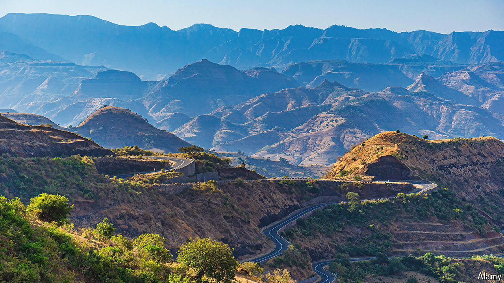

###### Ransom notes

# Ethiopia is in the midst of a kidnapping epidemic 

##### As the government hails a new IMF deal, lawlessness is spreading 

 

> Aug 1st 2024 

The road from the Ethiopian capital, Addis Ababa, to the town of Debark in the northern highlands is one of the country’s busiest thoroughfares. These days it is also among the most dangerous. In recent months travellers have been terrorised by armed gangs who kidnap bus drivers and their passengers for ransom. On July 3rd more than 100 people were taken hostage by highwaymen demanding up to 1m birr ($17,500) per captive. “We’re too poor to pay,” says one relative. The sibling of another hostage says the kidnappers warned families that without payment they would never see their loved ones alive again. 

