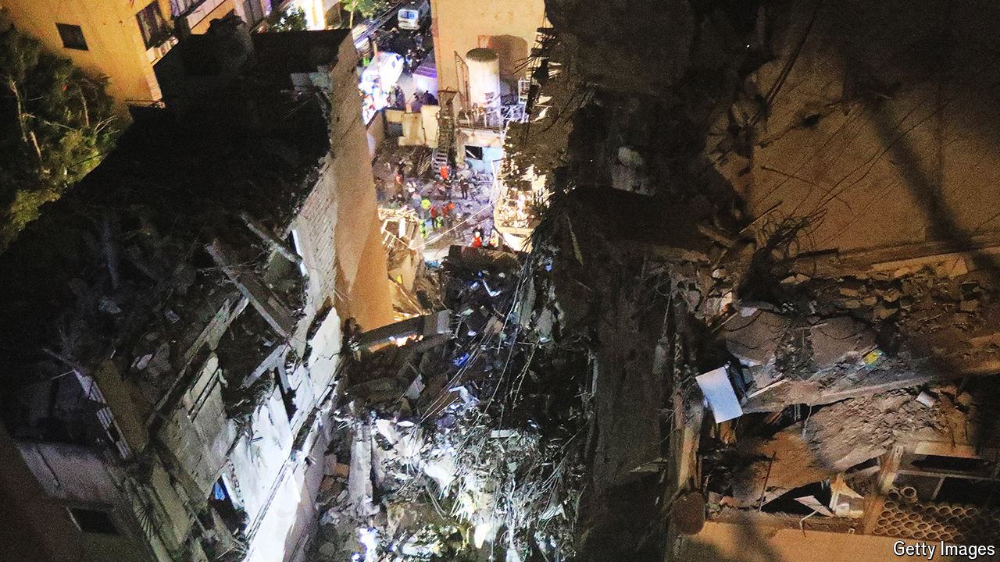

###### Two knocks in the night

# Israeli strikes on Beirut and Tehran could intensify a regional war 

##### At the very least, they will delay talks over a ceasefire in Gaza 

 

> Jul 31st 2024 

SEVEN HOURS and 1,500 kilometres separated the air strikes in two Middle Eastern capitals. Both were part of an Israeli operation that could lead to a dramatic escalation in a  which has been raging for nearly ten months. 

