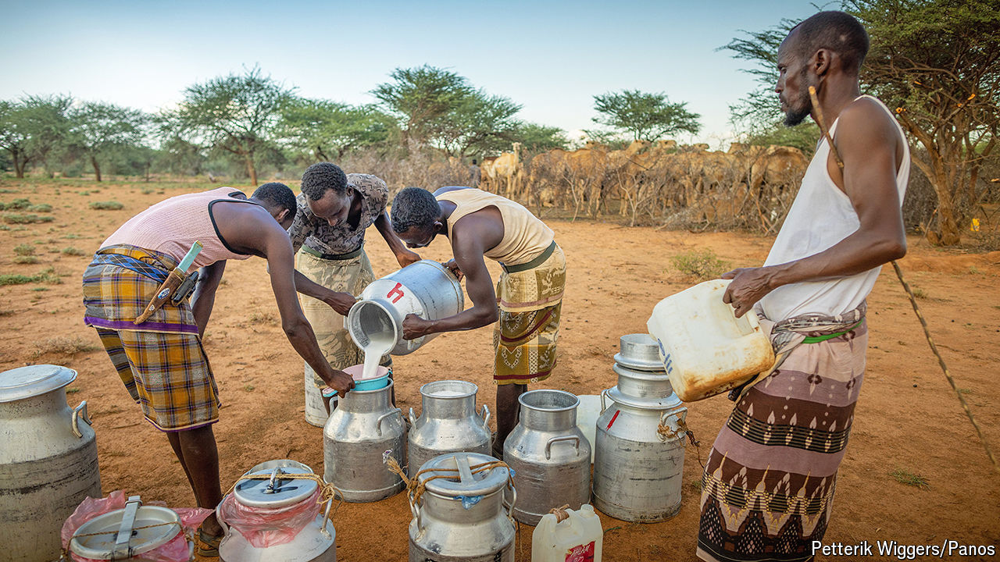

###### Under the hump

# Somaliland’s camel herders are milking it 

##### Commercial dairies are scaling up an old trade 

 

> Aug 1st 2024 

It is milking time on Mustafa Duale’s farm and the camels are lowing: an eerie groan, like the creak of an old door. A dozen herders strain the milk through a sieve into metal pails. They will sleep here tonight, in the open, beside a pen of thorns. The pails will be loaded into the back of an estate car and reach Hargeisa, the capital of Somaliland, with the setting sun.

