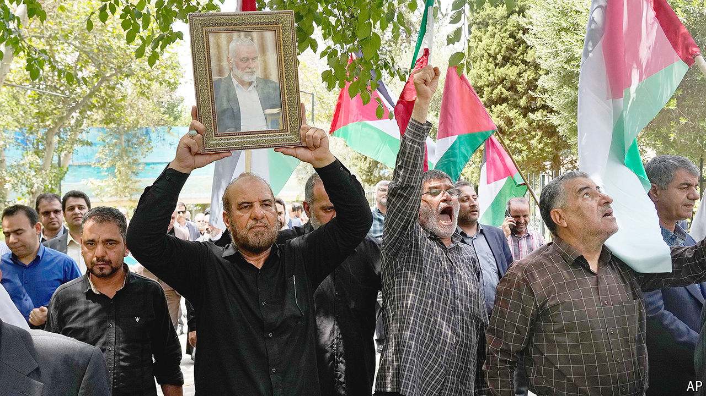

###### After Ismail Haniyeh

# Will Hamas turn from war to politics? 

##### The assassination of its political leader poses a string of dilemmas 

 

> Aug 1st 2024 

On paper Ismail Haniyeh, assassinated in Tehran on July 31st, was Hamas’s supreme leader. When in 2022 he ran for a second term in that role, he was unopposed. But for the past ten months, since Hamas’s attack on Israel on October 7th, he has often looked more like a postman. The focus of leadership shifted to Gaza, while Mr Haniyeh ran the political wing from Qatar. The decision to continue war or seek a ceasefire has lain with the Qassam Brigades, the military wing led by Yahya Sinwar. Mr Haniyeh relayed messages.

