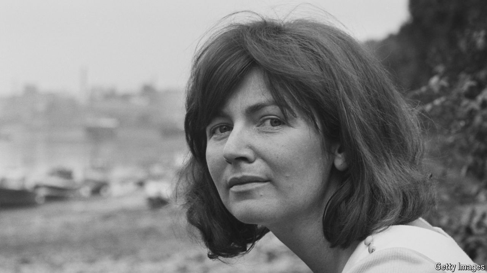

###### The Country Girl

# Edna O’Brien’s books scandalised Ireland 

##### The novelist and playwright died on July 27th, aged 93 

 

> Jul 31st 2024 

They burned her book. Priests denounced it from the pulpit; in her hometown they burned it in the parish grounds, after the rosary. Some people, Edna O’Brien’s mother told her, had even fainted as it was burned. That must have been the smoke, she had retorted. There was no shortage of people telling her how angry everyone was. Some said they wanted to lynch her. One said there would be a stoning next. The local postmistress said she should be kicked naked through the town. Later, she wished she had queried that one: why “naked”? 

